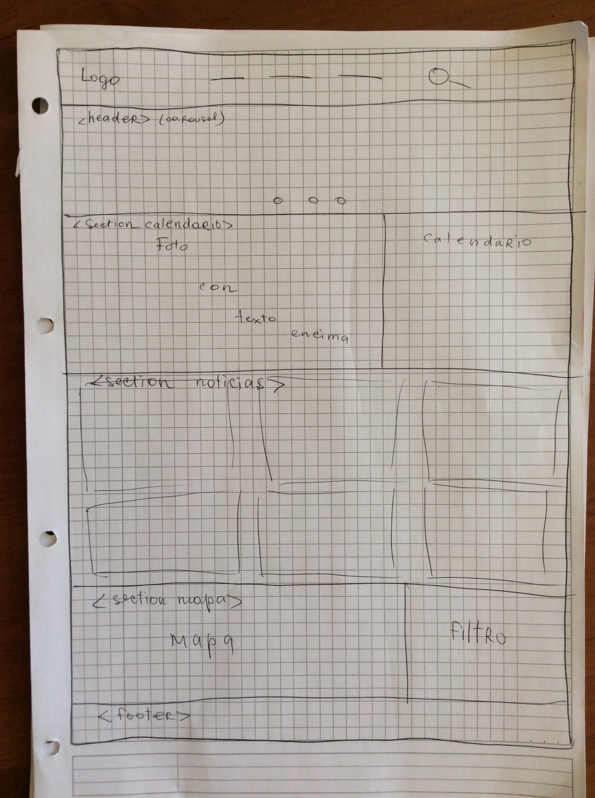
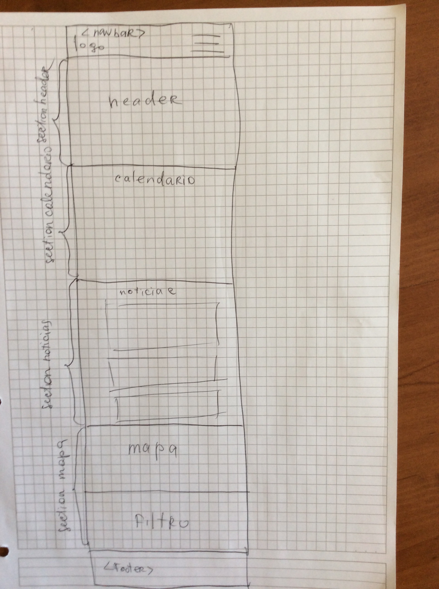

# Proyecto KidsReview

[video](https://www.youtube.com/watch?v=fOt499wIxO8&feature=youtu.be)

[link al proyecto en produccion](http://186.64.118.50/~feg11mariia/)

[link al proyecto en gh-pages](https://mariia1304.github.io/proyecto_final/index.html)
  
**KidsRewiev()**
   
          El proyecto combina una "guía para niños" en       region Metropolitana, reseñas con fotos y pósters(todavia no).
   
     - museos para niños
     - Entretenimiento y atracciones para niños.
     - jardines y parques
     - Restaurantes con sala infantil.
     - Parques acuáticos y piscinas.
     - hoteles para niños
     - pistas de hielo

    Y mucho más con descripciones, contactos, 
    
      fotos y comentarios.

   
   - Objetivos para la interfaz y para la experiencia del usuario (1 punto)
   
      - SIMPLICIDAD

   
   - Requerimientos del sitio (1 punto):

     
      - debe tener buscador
      - debe tener mapa para poder encontrar lugares cercanos al cliente
      - sitio debe ser responsivo

      
      ( Boceto a mano (imagen agregada a README.md y a carpeta images) (1
punto)):

   
   
   
   
##Requesitos generales
   
    Definición de layout (1 punto)
- Una página web tipo landing-page que contiene:

  - Una barra de navegación y un footer.
  - 4 secciones:
      - La primera, header
      - La segunda seccion, calendario
      - La tercera sección, eventos
      - La cuarta seccion, mapa con filtro
      
   
   
##Requerimientos específicos:
   - Iconos con background ??
      - *Usar repositorio "Font Awesome"*       
   - Mapa de ubicacion con lugares y un filtro
      - *iframe y averiguar como colocar el filtro*
   - Calendario con eventos
      - *como agregar eventos a un calendario*
   - Secciónes con grilla
      - *Usar Bootstrap*

      
##Requerimientos visuales:
   - Layout:
      - Para crear layout usar Bootstrap.
   - Fuentes *(Buscar en Google Fonts)*:
      - Títulos:
      - Párrafos y otros:
   - Colores:
       #083b66
       #4bc5d1
      - Letras:?
      - Botones y background de íconos:?
      - Barra de navegación y footer:?
      - Letras de barra de navegación y footer:? 
   - Imagenes
